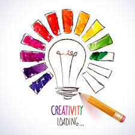

# My First Coding Assignment

##About Me
I have worked in the IT field for the majority of my career.  My roles have grown from System Support to Network Support and currently I am the Release Management Anlayst.  My goal is to gain the skills that will allow me to exit my current job in a few years and step in the world of entrepeneurship.
## Past Coding Experience
I have had coding classes in the past that were requirements. I can say that it wasn't on my radar at the time.  Currently, I see the value in coding and I am focused on building a solid foundation of knowledge.
## Career Goals
My first goal is bolster my knowledge of coding and apply to my current work. I would like to possibly move in the Marketing Department at some point.  Ultimately, I want to use my Master's degree to create the path to  my exit.
